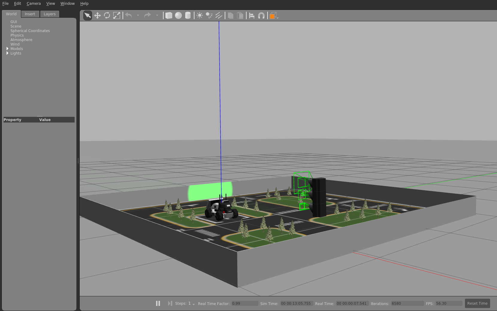

# AgileX Limo Gazebo Simulation
This Repo holds all the necessary information needed to run the simulation, the needed: packages, files, etc. and how to install them.
After the initial setup you will be able to simulate everyting from the real Limo on the same simulation table or your own world.

For this we will use Gazebo and ROS.
More information about that here:
- Gazebo: https://gazebosim.org/home
- ROS: https://www.ros.org

## Initial Setup
### Environment
You can use WSL2 with Ubunutu 20.04 (Setup: https://learn.microsoft.com/en-us/windows/wsl/install) if you are on windows or use native Linux also with Ubuntu 20.04.
For ROS we use Noetic (Setup: https://wiki.ros.org/noetic/Installation/Ubuntu). 

### Extra packages
- ros-control function package, robot control middleware
  ```
  sudo apt-get install ros-noetic-ros-control 
  ```
- ros-controllers function package, kinematics plug-in of common models provided by ROS
  ```
  sudo apt-get install ros-noetic-ros-controllers 
  ```
- gazebo-ros function package, communication interface between gazebo and ROS
  ```
  sudo apt-get install ros-noetic-gazebo-ros
  ```
- gazebo-ros-control function package, communication standard controller between ROS and Gazebo
  ```
  sudo apt-get install ros-noetic-gazebo-ros-control
  ```
- joint-state-publisher-gui package, used to visualize the joint control
  ```
  sudo apt-get install ros-noetic-joint-state-publisher-gui 
  ```
- rqt-robot-steering plug-in, a ROS tool closely related to robot motion control, it can send the control command of robot linear motion and steering motion, and the robot motion can be easily controlled through the sliding bar
  ```
  sudo apt-get install ros-noetic-rqt-robot-steering 
  ```
- telop-twist-keyboard is keyboard control function package, the robot can be controlled to move forward, left, right and backward through "i", "j", "l",and "," on the keyboard
  ```
  sudo apt-get install ros-noetic-teleop-twist-keyboard 
  ```
- rosdep, a command-line tool for installing system dependencies
  ```
  sudo apt-get install python3-rosdep
  ```

### Setup workspace
- Create the workspace with name of your choice, for example limo_ws
  ```
  mkdir -p limo_ws/src
  ```
- Initialize the src folder and clone the github
  ```
  cd limo_ws/src
  ```
  ```
  catkin_init_workspace
  ```
  ```
  git clone https://github.com/ArneFlipts/LimoGazeboRepo.git
  ```
- Go back to the root folder (limo_ws) and check if all the dependencies are installed/compile everything 
  ```
  cd ..
  ```
  ```
  rosdep install --from-paths src --ignore-src -r -y
  ```
  ```
  catkin_make
  ```

#### Setup remark
Before you can use this simulation there is one quick thing that needs to be changed. Go into LimoGazeboRepo/limo_simulator/limo_gazebo/worlds/SmollTable.world and in here to line 194 and 201. Here you want to change the uri to what's applicable to you.

### Check if the setup was successful
- In the root folder (limo_ws) source the correct script
  ```
  source devel/setup.bash
  ```
- Run the start file of limo and visualize the model in Rviz
  ```
  roslaunch limo_gazebo limo_four_diff.launch
  ```
You should see something like this:


## The actual Simulation
### Limo drive modes
Here we made a distinction between two drive modes: Ackerman mode and Four-wheel differential steering movement mode
For both we need to again source in the root folder
```
source devel/setup.bash
```

#### Ackerman mode
- Start the simulation environment
  ```
  roslaunch limo_gazebo limo_ackerman.launch
  ```
- Start rqt_robot_steering movement control plug-in, the sliding bar can control the robot motion
  ```
  rosrun rqt_robot_steering rqt_robot_steering
  ```

#### Four-wheel differential mode
- Start the simulation environment
  ```
  roslaunch limo_gazebo limo_four_diff.launch
  ```
- Control by keyboard, the robot can be controlled to move forward, left, right and backward through "i", "j", "l",and "," on the keyboard
  ```
  rosrun teleop_twist_keyboard teleop_twist_keyboard.py
  ```

### Creating a map and navigating on that map
We will simulate two ways of mapping: GMapping and RTABMap
One thing to note, unlike the real life counterpart we wont need to initialize the sensors first. As this gets done in the xacro and gazebo files, 
in these files you can also play with some sensor values.

#### GMapping
##### Create a map
- Initialize the environment and Limo (When creating the map it does not matter what drive mode gets used).
  On how to do this see [This](#Limo-drive-modes).
- Start GMapping
  ```
  roslaunch limo_navigation limo_gmapping.launch
  ```
- Visualize the mapping process
  ```
  roslaunch limo_viz view_navigation_gmapping.launch
  ```
- Once the map is complete, save it (It will get saved in the directory the command was run)
  ```
  rosrun map_server map_saver
  ```
##### Autonomous Navigation
- Start Navigation with Ackerman mode
  ```
  roslaunch limo_navigation limo_navigation_amcl_ackerman.launch
  ```
- Or start navigation with Four-diff mode
  ```
  roslaunch limo_navigation limo_navigation_amcl_diff.launch
  ```
- Visualize the process
  ```
  roslaunch limo_viz view_navigation_gmapping.launch
  ```
- To send the robot a goal, use the interactive 2D Nav Goal tool in RVIZ or send a message on the topic: /move_base_simple/goal topic !ADD EXAMPLE MESSAGE!

#### RTABMap
##### Create a map
- Initialize the environment and Limo (When creating the map it does not matter what drive mode gets used).
  On how to do this see [This](#Limo-drive-modes).
- Start RTABMap`
  ```
  roslaunch limo_navigation limo_rtabmap.launch
  ```
- Visualize the mapping progress
  ```
  roslaunch limo_viz view_navigation_rtabmap.launch
  ```
- To save the map you can just stop the process from step one and the map will get saved in ~/.ros as rtabmap.db

##### Autonomous Navigation
- Start Navigation with Ackerman mode
  ```
  roslaunch limo_navigation limo_navigation_rtabmap_ackerman.launch
  ```
- Or start navigation with Four-diff mode
  ```
  roslaunch limo_navigation limo_navigation_rtabmap_diff.launch
  ```
- Visualize the mapping progress
  ```
  roslaunch limo_viz view_navigation_rtabmap.launch
  ```
- To send the robot a goal, use the interactive 2D Nav Goal tool in RVIZ or send a message on the topic: /move_base_simple/goal topic !ADD EXAMPLE MESSAGE!

#### Some remarks
these methodes will use the sensors (GMapping only the lidar, RTABMap both lidar and camera) data to estimate its location on the map. This methode is not foolproof but moving around with the robot will increase the precision, this is something that has to be done once and then it can drive around on its own without issue. One thing that helps with this is finishing the mapping process in the same spot (location and the way it was facing).

## Important files and folders
### AgileX Limo visual and sensors
The first thing that gets touched is the visual aspect of the Limo aswell as the sensors.
You can find everything there is to this here: /LimoGazeboRepo/limo/limo_description/

The meshes folder contains the visual aspects of the Limo.

Then this leaves the urdf folder. Everything from the way the wheels interact with the body to the sensor specs are defined in here. The way everything is being hold together is specified in the .xacro files while the sensors and controllers get defined in the .gazebo files.
So say you want to change the depth camera specs, then you would need to go into limo_gazebo.gazebo and change it in here.

### Simulation environment
The next thing on the list is everything to do with the simulation environment. The first import folder here is the launch folder. This holds the different launch files for the different drives modes aswell as simulation environments. 

Models hold the mesh and material files for the simulation table, if you want to add your own models then that can be done in here aswell. Just take into account that when using those models you need to tell gazebo where to find them with the uri tag in the world files. 

The src folder holds control files. For example MyFlashLightPlugin.cc is an extention on the FlasLightPlugin from gazebo itself and is what controlls the stoplight on the simulation table. 

The worlds folder hold the actual simulation world with everything thats on the table being defined in here. 

### Navigation aspect
Here we have two important folders: /LimoGazeboRepo/limo/limo_navigation and /LimoGazeboRepo/limo_desktop/limo_viz

#### Navigation
Launch subfolder holding all the launch files for GMapping and RTABMap mapping and navigation (both drive modes). 
Then we also have the params folder with amcl_params.yaml for GMapping and move_base folder holding the other param files for the move_base setup. In move_base we define:
- the common costmap params such as the footprint of the Limo and the setup params for the plugins (the layers added to the costmap). 
- global/local costmap params holds some basic setup params aswell as what plugins to use. 
- global/local planner defines what planner gets used and its setup.

#### Vizualisation
The launch file for rviz, starts rviz with the param file (.rviz files).
The .rviz files, in here you can add or remove what gets shown on rviz when calling this launch file. 